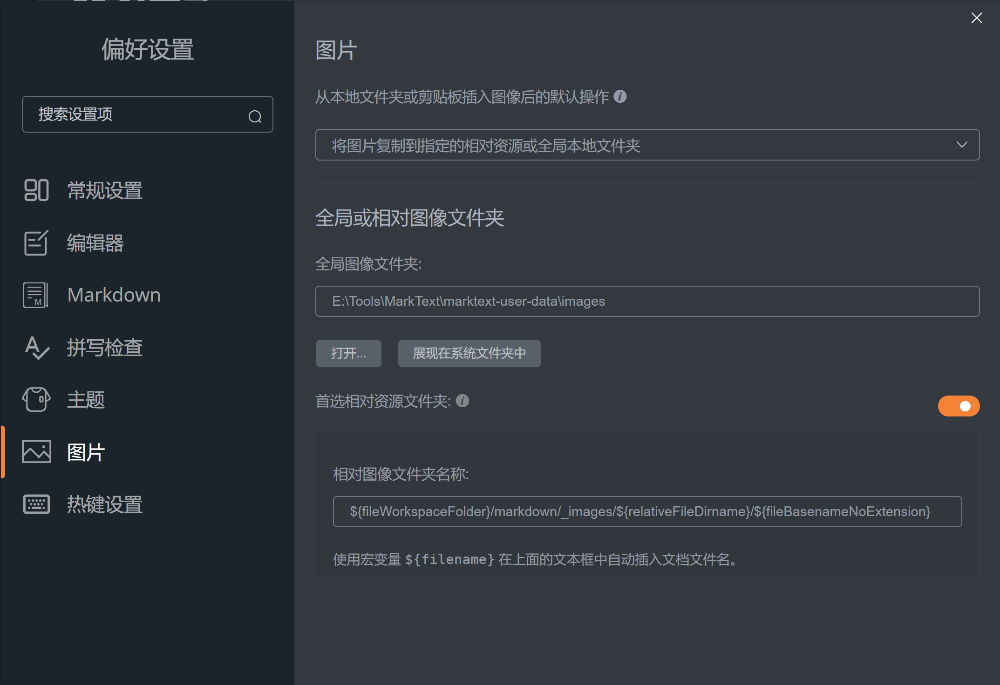
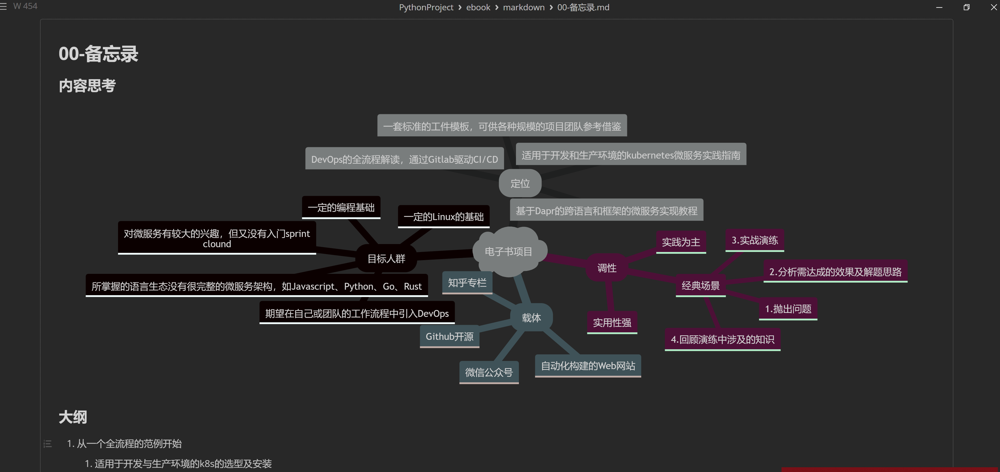
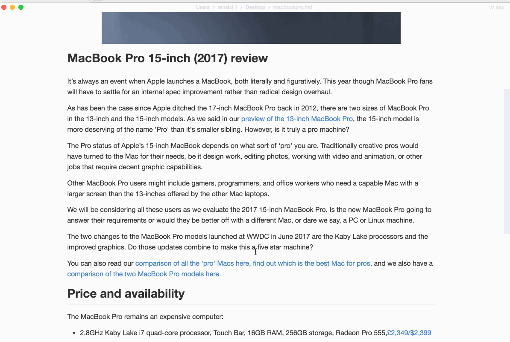

---

# 中文特别版

## 为什么会有这个特别版

> 笔者的Ebook的项目选择了Markdown作为工件格式，期望编辑器能够：

- 至少部分实现所见即所得的效果，提高编辑效率；
- 能够基于项目体系的来持久化图片文件，图片文件的存储结构相对于Ebook项目应该是稳定的。
- 最好能够内联思维导图、流程图及UML图形，则无需再采用第三方工具来制图。
- 编辑器支持的Markdown组件应与Ebook网站完全兼容，且复制原始md文件来直接生成网站，结构稳定后不应该有额外的修改工作。

> MarkText 0.17.1能大部分满足上述需求，但存在以下几点比较严重的问题：

1. 自2022-3-8后就没有再更新了，不支持Mermaid 中的 mindmap；
2. 全局的配置文件，不利于每个不同Ebook项目的个性化配置；
3. 用于存储图片的相对路径图像文件夹支持的预置变量太少，不能满足复杂结构项目的需求；

## 案例
- [OneClickPack](https://github.com/topabomb/OneClickPack)
- [console-craft.js](https://github.com/topabomb/console-craft)
- [youtube-musicvideo-downloader](https://github.com/topabomb/youtube-musicvideo-downloader)
- [openai-api-forward](https://github.com/topabomb/openai-api-forward)
- wedid_chain
- [DeBorder AI Toolkit](https://deborderai.weero.net/)
- ...

## 已实现特色

- 优化样式，提升空间利用率及操作体验；

- Mermaid更新到较新版本；

- 增加 Mermaid mindmap的支持；

- 修改为中文版本，感谢[chinayangxiaowei](https://github.com/chinayangxiaowei/marktext-chinese-language-pack)提供的思路；

- 类似于vscode工作区，打开不同的目录可以应用不同的设置，folder settings 文件名为marktext.json；
  
  > 例如针对文件夹
  
  ```json
  {
    "imageRelativeDirectoryName": "${fileWorkspaceFolder}/markdown/_images/${relativeFileDirname}/${fileBasenameNoExtension}",
    "imagePreferRelativeDirectory": true,
    "imageInsertAction": "folder",
    "theme": "one-dark"
  }
  ```

- 优化剪贴板图片的复制的处理，可以通过多个预置变量来个性化图片的本地存储路径；
  
  | 变量名                         | 说明                           |
  | --------------------------- | ---------------------------- |
  | `{filename}`                | 不包含扩展名                       |
  | `{fileBasenameNoExtension}` | 同filename，用于与vscode变量兼容      |
  | `{fileWorkspaceFolder}`     | 当前打开的项目目录，与vscode变量兼容        |
  | `{relativeFileDirname}`     | 当前文件相对项目根目录的相对路径，与vscode变量兼容 |

## 截图





# 经典版的特性

- 实时预览（所见即所得）和简洁明了的界面，使您获得无干扰的写作体验。
- 支持 [CommonMark 规范](https://spec.commonmark.org/0.29/)和 [GitHub Flavored Markdown 规范](https://github.github.com/gfm/)。
- Markdown扩展，例如数学表达式（KaTeX）、front matter 和 emoji。
- 支持段落和内联样式快捷方式，以提高您的写作效率。
- 输出 **HTML** 和 **PDF** 文件。
- 各种主题：**Cadmium Light**、**Material Dark** 等等。
- 各种编辑模式：**源代码模式**、**打字机模式**、**专注模式**。
- 直接从剪贴板中粘贴图片。

<h4 align="center">主题</h4>

| Cadmium Light                              | Dark                                     |
|:------------------------------------------:|:----------------------------------------:|
|   |          |
| Graphite Light                             | Material Dark                            |
|  |  |
| Ulysses Light                              | One Dark                                 |
|   |      |

<h4 align="center">编辑模式</h4>

| 源代码                       | 打字机                           | 专注                       |
|:-------------------------:|:-----------------------------:|:------------------------:|
|  |  |  |
